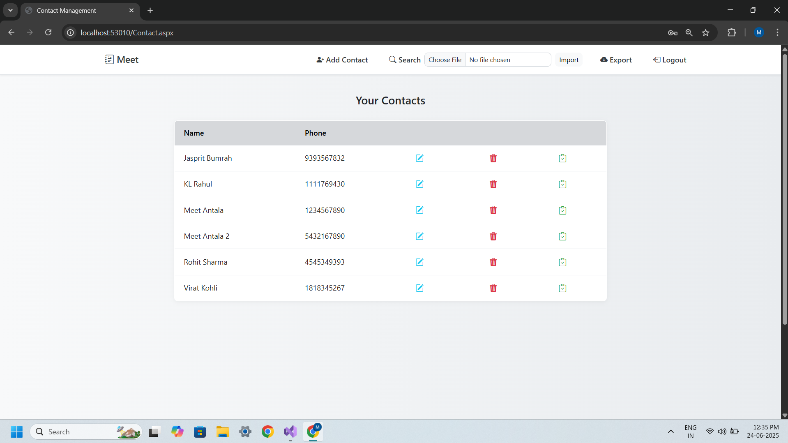
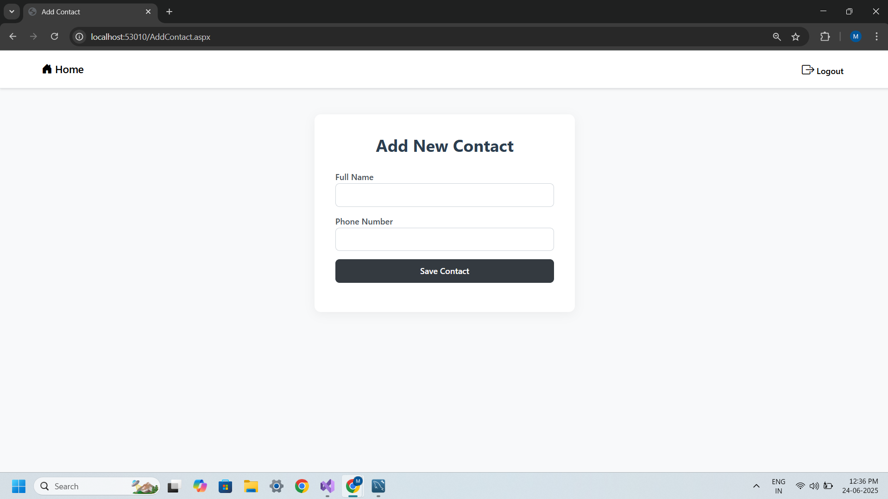
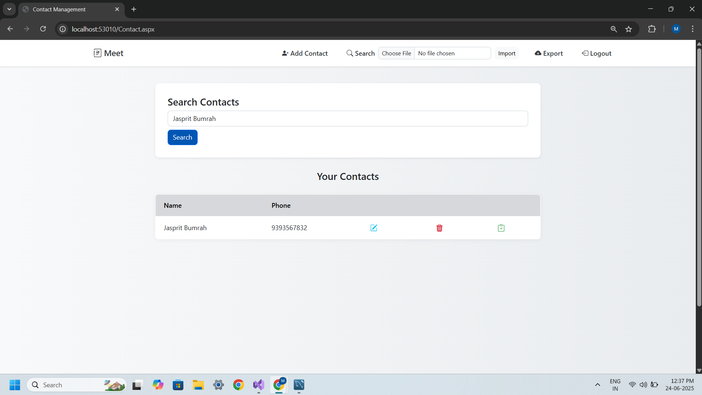
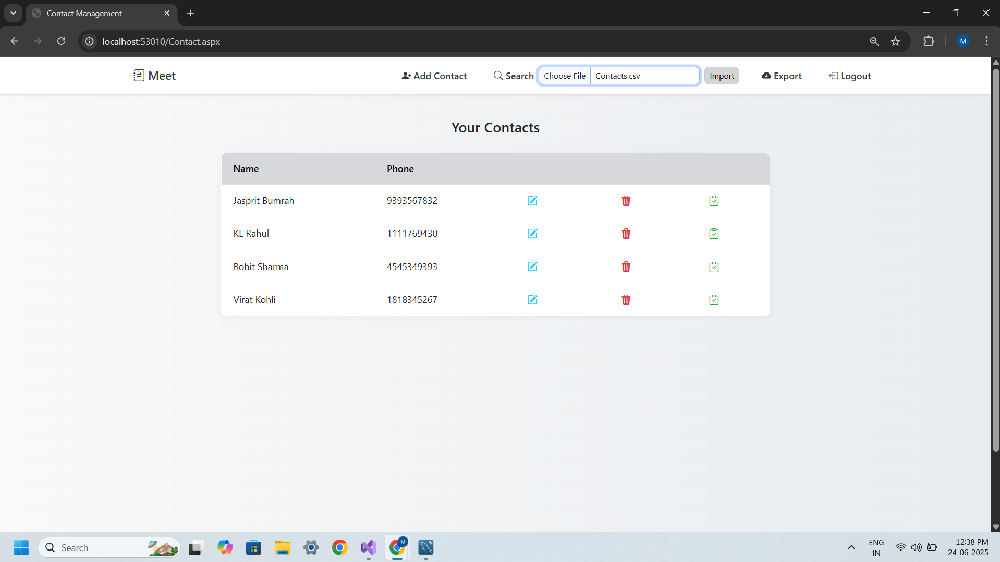
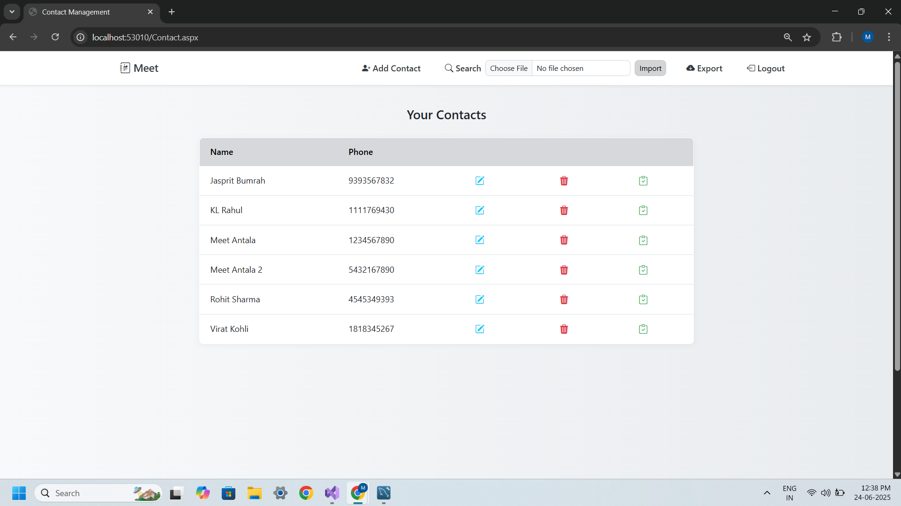
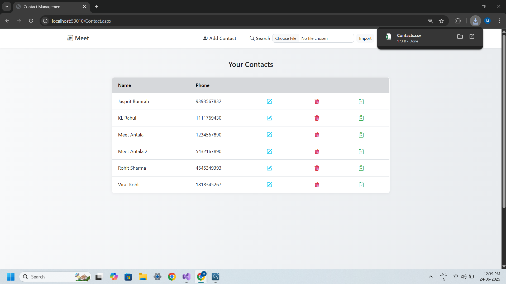

# 📇 Contact Management System

A professional and user-friendly web application built using ASP.NET that helps users manage their contacts efficiently. Supports adding, editing, searching, and bulk importing/exporting contacts via CSV files.

## 🚀 Features

- ➕ Add New Contacts
- ✏️ Edit Existing Contacts
- 📤 Import Contacts from `.csv` file
- 📥 Export Contacts to `.csv` file
- 🔍 Search Contacts by Name or Number
- 🧹 Responsive UI using Bootstrap 4/5
- 🗄️ Data stored in **MySQL** using MySQL Workbench

## 🛠️ Tech Stack

- **Frontend**: ASP.NET Web + Bootstrap
- **Backend**: C#
- **Database**: MySQL (via MySQL Workbench)
- **Tools**: ADO.NET, GridView, FileUpload, CSV parser

## 🖼️ Screenshots

